## Table of Contents
[Introduction](#introduction)

[Implementation Description](#implementation-description)

[Test Tools](#test-tools)

[Test Configuration](#test-configuration)

[Data Collection Method](#data-collection-method)

[Scenario 1: Parent Switch due to metric deterioration](#scenario-1-parent-switch-due-to-metric-deterioration)

[Scenario 2: Parent Switch because of connectivity loss](#scenario-2-parent-switch-because-of-connectivity-loss)

[Conclusion](#conclusion)

[Challenges faced](#challenges-faced)

# Introduction
RPL ([RFC6550](https://tools.ietf.org/html/rfc6550 "RPL")) is a routing protocol for Low power and lossy networks. This works tries to improve upon the route invalidation mechanism present in RPL which describes use of No-Path DAO (NPDAO) for route invalidation. Draft [draft-ietf-roll-efficient-npdao](https://tools.ietf.org/html/draft-ietf-roll-efficient-npdao-01) specifies change in this (NPDAO) signaling mechanism (both syntax and semantics) and introduces a new message called DCO (DODAG Cleanup Object) for more efficient route invalidation.

This page explains the performance impact of choosing DCO over NPDAO for route invalidation purpose.

# Implementation description
The implementation is done in a fork of 
[Contiki-whitefield](https://github.com/whitefield-framework/contiki/tree/npdao "NPDAO Branch of contiki-whitefield") 
(done by [Rabi](https://github.com/rabinsahoo)).

The implementation retains the NPDAO mechanism as it is and builds DCO on top of it. DCO is used only when parent-switching procedure is initiated by the node. In other cases, such as, on route lifetime expiry or other internal error scenarios the node would still use NPDAO messaging to invalidate the route.

## Implementation Statistics:
1. Lines of Code: ~120 [contiki-changes-for-DCO](https://github.com/contiki-os/contiki/commit/e8ea7790640f96c4a48ca1f8d95e1b7f7ac017f9)
2. Additional RAM: 0 ... The implementation adds use of Path-Sequence which is defined in base RPL and is currently missing in Contiki. Thus RAM-increase due to Path-Sequence addition is not considered. Anyways, addition of Path-Sequence results in 1 extra byte per routing entry.
3. Flash: 2.5KB

mode|text|data|bss|
----|----|----|---|
Without DCO|149596|1948|27296|
With DCO|152280|1948|27296|

* Contiki examples/ipv6/rpl-udp/ example compiled in native mode with and without DCO.

The implementation has further scope to be optimized by combining APIs needed to construct DAO and DCO messages since most of the buffer encoding/decoding remains same in both cases.

# Test Tools
* Simulation Framework: [Whitefield](https://github.com/whitefield-framework/whitefield "Whitefield-Framework") (Internally using [NS3 lr-wpan](https://github.com/nsnam/ns-3-dev-git/tree/master/src/lr-wpan) module in 2.4Ghz mode with single channel unslotted CSMA mode of operation)
* [Contiki(forked)](https://github.com/whitefield-framework/contiki/tree/npdao) as the network stack

All the data produced here is reproducible using Whitefield framework. All the scripts used for automation are part of the 'npdao' branch of the framework.

### Comments
* We didn't use Cooja for experimentation because the wireless model provided by Cooja is naive (i.e. the purpose of Cooja is to do emulation of platforms and provides a wireless mechanism that just works). For experiments such as these, using a realistic RF was rather important.

# Test Configuration
* Tests were done on a laptop [HP 820 G2](https://support.hp.com/in-en/document/c04543486)
* Ubuntu 16.04 running Whitefield (npdao branch)

1. cfg_n50_udp30

Config | Value
------ | -----
#nodes | 50
UDP Send Time | 30sec
Formation | Grid
Topology-Position | [pos_n50.png](data/pos_n50.png)
Topology-Tree | [tree_n50.png](data/tree_n50.png)

2. cfg_n100_udp30

Config | Value
------ | -----
#nodes | 100
UDP Send Time | 30sec
Formation | Grid
Topology-Position | [pos_n100.png](data/pos_n100.png)
Topology-Tree | [tree_n100.png](data/tree_n100.png)

# Data Collection Method

### [Script](https://github.com/nyrahul/whitefield/blob/npdao/tools/npdao/get_data.sh) to get the data
1. Start the network
2. Wait pre-determined time for network to form
3. [optional] Start a thread to [change_node_location](#thread-change_node_location) dynamically
4. For n in total_samples (scripts:[get_connectivity_snapshot.sh](https://github.com/nyrahul/whitefield/blob/npdao/scripts/get_connectivity_snapshot.sh)):
    1. Get connectivity snapshot i.e. unconnected nodes, stale entries, RPL control traffic stats, UDP send/recv stats, elapsed time
    2. wait for inter-sample-interval

### Thread change_node_location:
The aim of this thread is to move the 6LR nodes such that dependent (sub)child nodes start realigning to new parents resulting in route invalidation procedure been initiated.
1. Get connected node cardinality for the 6LR node. Cardinality refers to the number of child nodes connected through this 6LR. Note that we do not use routing table size because it may contain stale entries.
2. Get the node with highest cardinality.
3. Change this node's location such that the wireless range is out of reach
4. Will result in (sub)child nodes in switching parent nodes causing NPDAO or DCO been initiated.

### Getting stale entries stats
Stale entries refers to routing entries that the target node no longer uses for downstream traffic. Stale entries are left behind because of sub-optimal route invalidation. Getting these stats are non-trivial since it is difficult to understand which of the routing entries are no longer needed. Whitefield allows to query default route and routing entries for each of the node. It is possible to check based on current default route which is the upstream path which has been selected by the node and mark those routing entries. Since RPL currently establishes bidirectional path i.e. the upstream and downstream paths are essentially same, it is possible to verify which are active routing entries and which are stale.

Every experiment executed for close to 30 minutes taking 5 readings of each. The stale entries, unconnected nodes and other stats were sampled during this time.

# Scenario 1: Parent Switch due to metric deterioration
In case where the parent switch happens due to metric deterioration, the old parent is still reachable albeit with bad metrics. NPDAO which is required to be sent through old parent might still work in this case. We wanted to check following in this context:
1. How does DCO fares in terms of reducing stale routes in comparison to NPDAO?
    * Use of DCO resulted in less number of stale routes consistently. But the percentage difference was not much since NPDAO also would have succeeded in most cases.
2. Impact on control overhead of using DCO in place of NPDAO
    * DCO showed consistenly reduced control overhead. This was attributed to the fact the DCO traversed only the subDODAG rooted at the common ancestor.
3. Impact on packet delivery rate
    * There was no marked statistical difference in the packet delivery rate. The PDR was close to 99% in both cases.

cfg_n100_udp30||
:-----------------:|:--------------------:
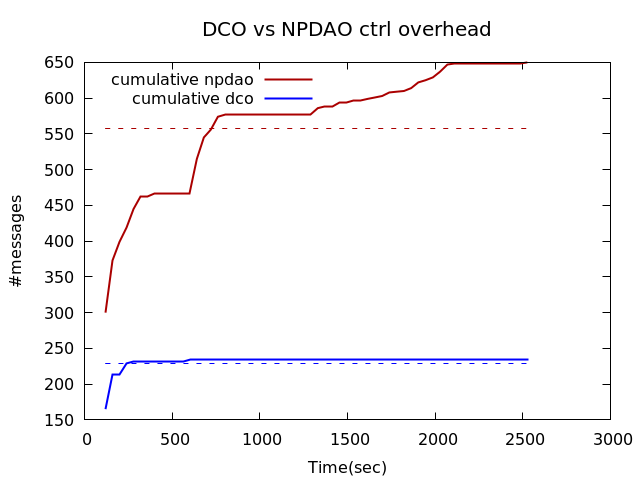|
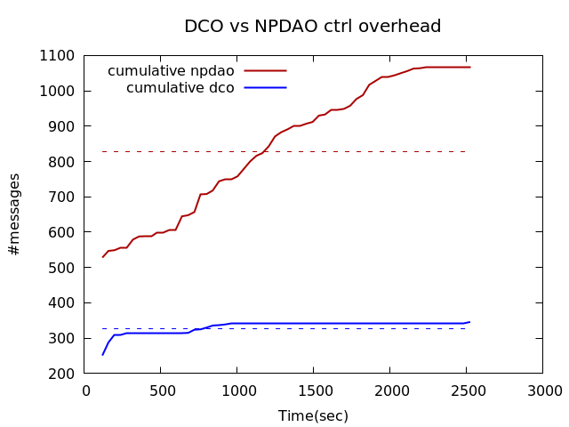|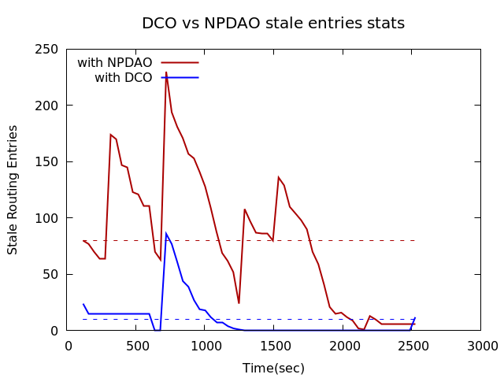
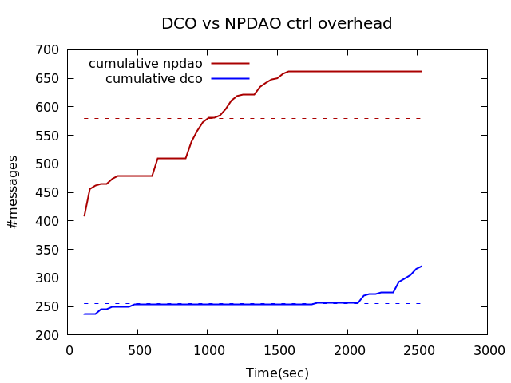|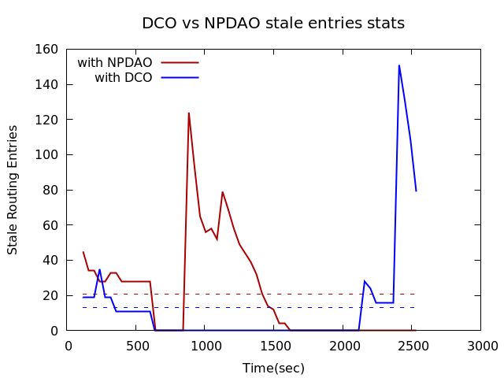

### Comments
* We were expecting improvements only in terms of reduction of stale entries but DCO seems to also impact the control overhead. This was a surprise especially because even in regular cases, sometimes the reduction was several order of magnitudes as compared to use of NPDAO. Please note that here we compare only the NPDAO and DCO traffic. NPDAO and DCO traffic is much less when compared to other RPL control messages such as DAO and DIOs (point is, no need to get very excited ;-))
* When DCO is used, you can see steep gradient for stale entries reduction unlike for NPDAO where stale entries linger for a longer time.
* We have not quoted packet delivery rate in the graphs because there is negligible impact on it. New route creation is handled by DAO messages which has no change thus the impact is negligible. The small positive improvement in context to DCO data with regards to PDR could be due to reduction route invalidation traffic. Interested folks may refer to the [raw data](data/) which clearly show UDP send/recv statistics in context to use of DCO and NPDAO.
* One must also check if the number of parent switches when DCO and NPDAO is used remains fairly similar. The parent switches which peaks initially after the first routes are formed and then subsides in both the cases. We found roughly equal number of parent switches both in DCO as well as in NPDAO case. Interested folks may refer to the [raw data](data/) which clearly shows parent switch stats in context to use of DCO and NPDAO.

# Scenario 2: Parent Switch because of connectivity loss
Parent switching can happen because of nodes losing connectivity to its parent node. In such cases, NPDAO would be highly sub-optimal because of its dependence on previous path for sending NPDAO. DCO however will continue to work in such cases and should reduce the impact of stale entries in the network.

In this experiment we used the [above](#data-collection-method) mentioned technique/script to change the 6LR node positions dynamically so as to cause connectivity loss for corresponding child nodes.

cfg_n50_udp30||
:-----------------:|:--------------------:
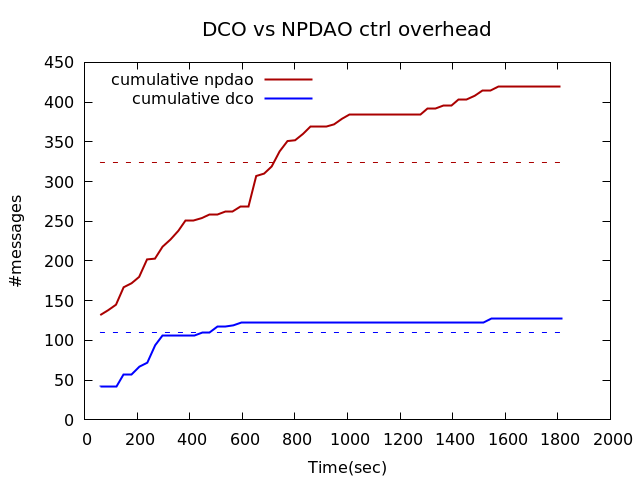|
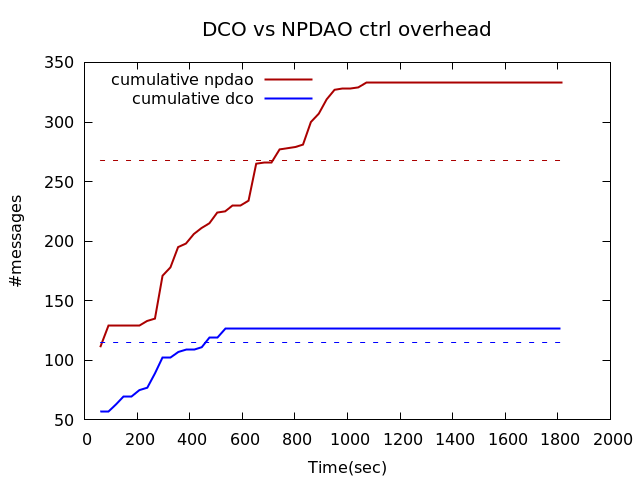|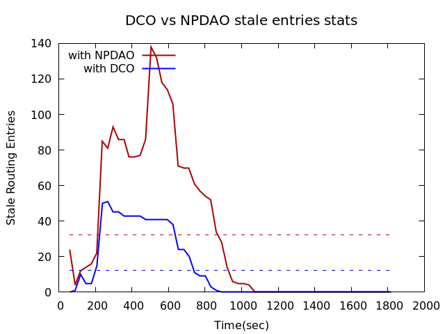
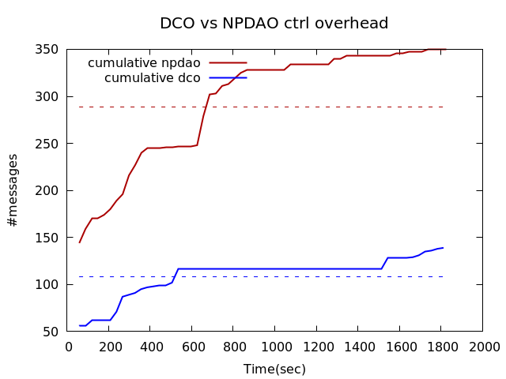|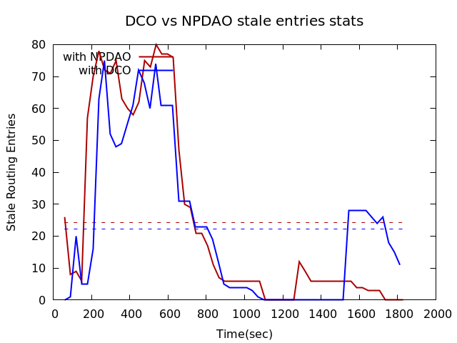
cfg_n100_udp30||
|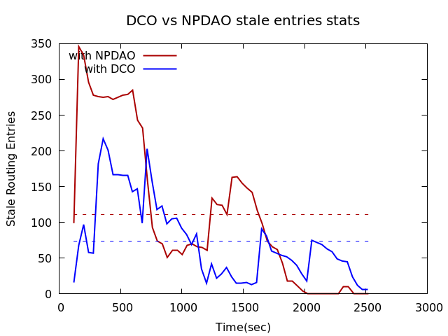
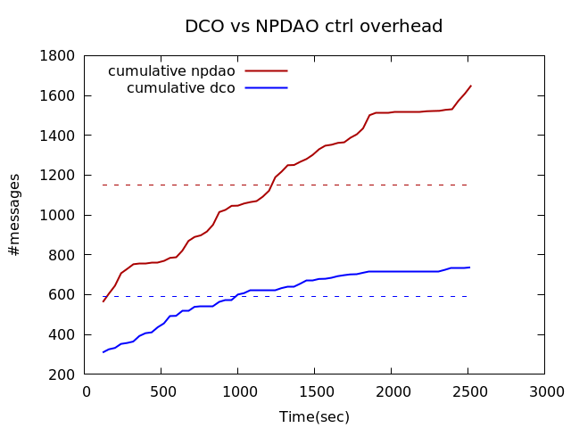|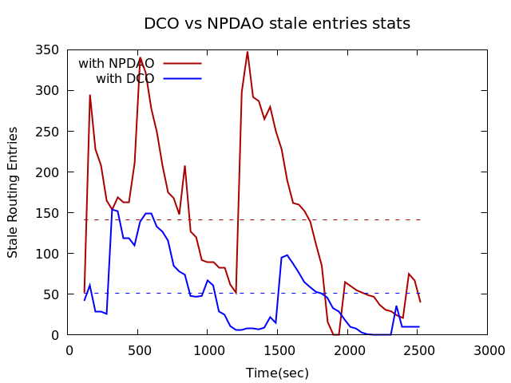
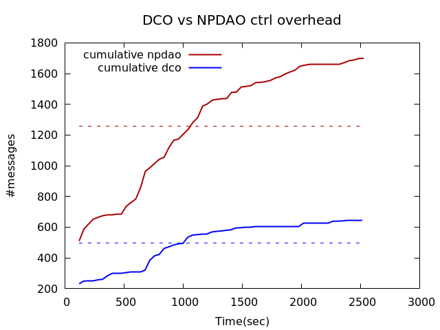|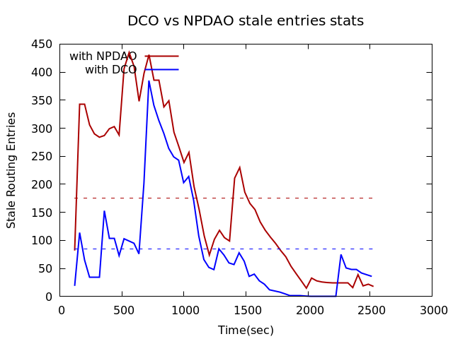

### Comments
* Because we were changing the 6LR nodes position dynamically, there was a mich bigger impact on the use of DCO and NPDAO. DCO scored much higher points in this context.
* Please note that the y-axis scales differ for different configuration (for e.g. between cfg_n50_udp30 to cfg_n100_udp30).

# Conclusion
DCO not only reduces the overall stale entries in the network but also helps in reducing the route invalidation traffic.

# Challenges faced
* In bigger networks, there is higher probability that DAO will fail on its way for certain nodes. We found that 3 to 4% of nodes usually take much longer to join the network. For e.g. in a 100 node network (cfg_n100_udp30) almost 95-96 nodes join the network i.e. the BR has a routing entry in less than couple of minutes. But subsequently it takes a longer time, almost 10 minutes in certain cases for the rest of nodes to join.
* Whitefield works using realistic RF simulation provided by NS3. Thus it was difficult to ascertain a particular topology i.e. a 6LR nodes in one experiment may have 3 child nodes and in other case may have 5 nodes. We ended up using a logic that we sort the 6LRs based on the child count and then use it to change the 6LRs node position so as to result in connectivity loss. We then took several rounds (5 rounds) of data. Thus the difference in some cases was much larger than others but in all cases we found that DCO outperforms NPDAO.

